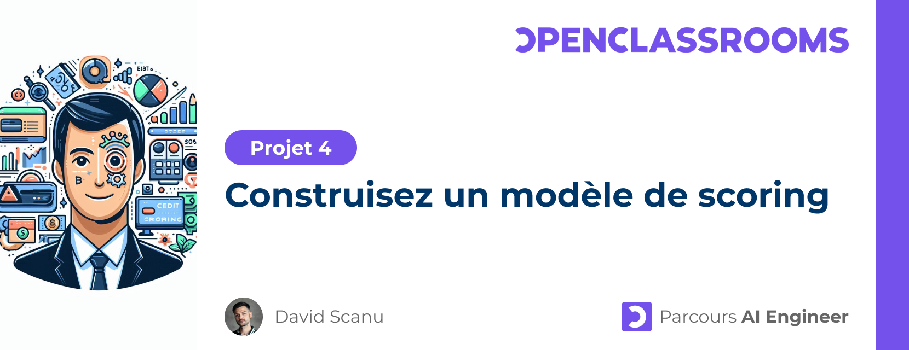

# Projet 4 - Construisez un modèle de scoring

> 🎓 OpenClassrooms • Parcours [AI Engineer](https://openclassrooms.com/fr/paths/795-ai-engineer) | 👋 *Etudiant* : [David Scanu](https://www.linkedin.com/in/davidscanu14/)

## 📝 Contexte

Vous êtes Data Scientist au sein d'une société financière, nommée "Prêt à dépenser", qui propose des crédits à la consommation pour des personnes ayant peu ou pas d'historique de prêt. Pour accorder un crédit à la consommation, l’entreprise souhaite **mettre en œuvre un outil de “scoring crédit”** qui calcule la probabilité qu’un client le rembourse ou non, puis classifie la demande : crédit accordé ou refusé. Les chargés de relation client seront les utilisateurs de l’outil de scoring et ont besoin que le modèle soit facilement interprétable, avec une mesure de l’importance des variables influençant la décision.

## ⚡ Mission

**Développer un algorithme de classification** pour aider à décider si un prêt peut être accordé à un client. Le modèle doit être interprétable par les équipes qui vont l’utiliser, avec une analyse de l’importance des variables globale au modèle et locale pour un client donné. Le modèle doit également prendre en compte le déséquilibre entre le nombre de bons et de moins bons clients, ainsi que le coût métier entre un faux négatif et un faux positif.

## 💾 Jeux de données

Pour réaliser ce modèle, [un jeu de données](https://s3-eu-west-1.amazonaws.com/static.oc-static.com/prod/courses/files/Parcours_data_scientist/Projet+-+Impl%C3%A9menter+un+mod%C3%A8le+de+scoring/Projet+Mise+en+prod+-+home-credit-default-risk.zip) contenant :
- un historique de prêts,
- un historique d’informations financières,
- des informations sur le comportement des emprunteurs (si l’emprunteur a fait défaut ou pas).

## 🎯 Objectifs pédagogiques

- Créer les variables pertinentes d'un modèle d'apprentissage supervisé ou non-supervisé
- Évaluer les performances des modèles d’apprentissage supervisé selon différents critères
- Sélectionner et entraîner des modèles d’apprentissage supervisé

## 📊 Présentation

- Compréhension de la problématique métier
- Description du jeu de données
- Transformation du jeu de données (nettoyage et feature engineering)
- Comparaison et synthèse des résultats pour les modèles utilisés
- Interprétabilité du modèle
- Conclusion

## 📦 Livrables

- Notebooks : 
  - Analyse exploratoire
  - Entrainement et évaluations des modèles
- [Présentation]()